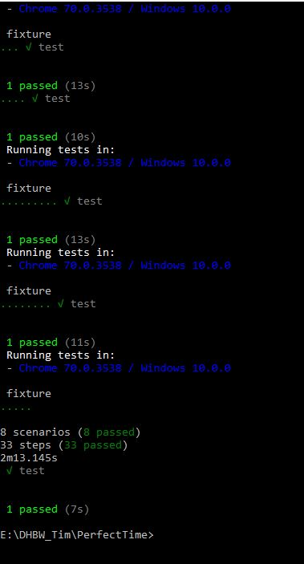
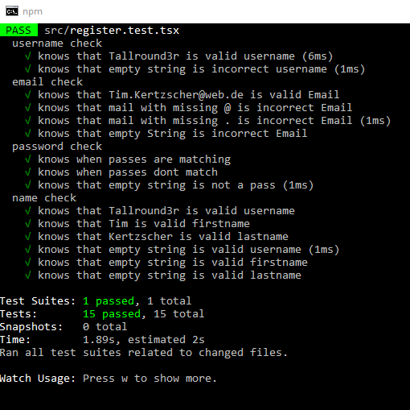
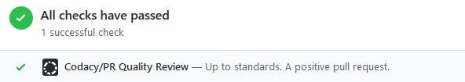
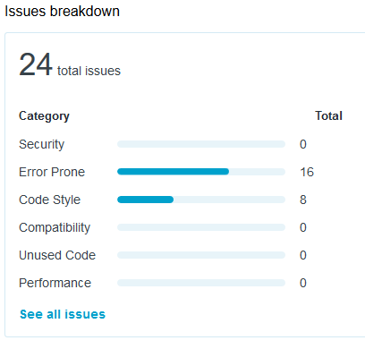
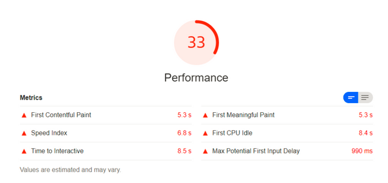

# PerfectTime Test Plan
**Version 1.0**

## Table of Contents

[1. Introduction](#1-introduction) 
&emsp; [1.1 Purpose](#11-purpose) 
&emsp; [1.2 Scope](#12-scope) 
&emsp; [1.3 Intended Audience](#13-intended-audience) 
&emsp; [1.4 Document Terminology and Acronyms](#14-document-terminology-and-acronyms) 
&emsp; [1.5  References](#15--references) 
&emsp; [1.6 Document Structure](#16-document-structure) 
[2. Evaluation Mission and Test Motivation](#2-evaluation-mission-and-test-motivation) 
&emsp; [2.1 Background](#21-background) 
&emsp; [2.2 Evaluation Mission](#22-evaluation-mission) 
&emsp; [2.3 Test Motivators](#23-test-motivators) 
[3. Target Test Items](#3-target-test-items) 
[4. Outline of Planned Tests](#4-outline-of-planned-tests) 
&emsp; [4.1 Outline of Test Inclusions](#41-outline-of-test-inclusions) 
&emsp; [4.2 Outline of Other Candidates for Potential Inclusion](#42-outline-of-other-candidates-for-potential-inclusion) 
&emsp; [4.3 Outline of Test Exclusions](#43-outline-of-test-exclusions) 
[5. Test Approach](#5-test-approach) 
&emsp; [5.1 Initial Test-Idea Catalogs and Other Reference Sources](#51-initial-test-idea-catalogs-and-other-reference-sources) 
&emsp; [5.2 Testing Techniques and Types](#52-testing-techniques-and-types) 
&emsp; &emsp; [5.2.1 Data and Database Integrity Testing](#521-data-and-database-integrity-testing) 
&emsp; &emsp; [5.2.2 Function Testing](#522-function-testing) 
&emsp; &emsp; [5.2.3 Business Cycle Testing](#523-business-cycle-testing) 
&emsp; &emsp; [5.2.4 User Interface Testing](#524-user-interface-testing) 
&emsp; &emsp; [5.2.5 Performance Profiling ](#525-performance-profiling-) 
&emsp; &emsp; [5.2.6 Load Testing](#526-load-testing) 
&emsp; &emsp; [5.2.7 Stress Testing](#527-stress-testing) 
&emsp; &emsp; [5.2.8 Volume Testing](#528-volume-testing) 
&emsp; &emsp; [5.2.9 Security and Access Control Testing](#529-security-and-access-control-testing) 
&emsp; &emsp; [5.2.10 Failover and Recovery Testing](#5210-failover-and-recovery-testing) 
&emsp; &emsp; [5.2.11 Configuration Testing](#5211-configuration-testing) 
&emsp; &emsp; [5.2.12 Installation Testing](#5212-installation-testing) 
[6. Entry and Exit Criteria](#6-entry-and-exit-criteria) 
&emsp; [6.1 Test Plan](#61-test-plan) 
&emsp; &emsp; [6.1.1 Test Plan Entry Criteria](#611-test-plan-entry-criteria) 
&emsp; &emsp; [6.1.2 Test Plan Exit Criteria](#612-test-plan-exit-criteria) 
&emsp; &emsp; [6.1.3  Suspension and Resumption Criteria](#613--suspension-and-resumption-criteria) 
&emsp; [6.2 Test Cycles](#62-test-cycles) 
&emsp; &emsp; [6.2.1 Test Cycle Entry Criteria](#621-test-cycle-entry-criteria) 
&emsp; &emsp; [6.2.2 Test Cycle Exit Criteria](#622-test-cycle-exit-criteria) 
&emsp; &emsp; [6.2.3 Test Cycle Abnormal Termination](#623-test-cycle-abnormal-termination) 
[7. Deliverables](#7-deliverables) 
&emsp; [7.1 Test Evaluation Summaries](#71-test-evaluation-summaries) 
&emsp; [7.2 Reporting on Test Coverage](#72-reporting-on-test-coverage) 
&emsp; [7.3 Perceived Quality Reports](#73-perceived-quality-reports) 
&emsp; [7.4 Incident Logs and Change Requests](#74-incident-logs-and-change-requests) 
&emsp; [7.5 Smoke Test Suite and Supporting Test Scripts](#75-smoke-test-suite-and-supporting-test-scripts) 
&emsp; [7.6 Additional Work Products](#76-additional-work-products) 
&emsp; &emsp; [7.6.1 Detailed Test Results](#761-detailed-test-results) 
&emsp; &emsp; [7.6.2 Additional Automated Functional Test Scripts](#762-additional-automated-functional-test-scripts) 
&emsp; &emsp; [7.6.3 Test Guidelines](#763-test-guidelines) 
&emsp; &emsp; [7.6.4 Traceability Matrices](#764-traceability-matrices) 
[8. Testing Workflow](#8-testing-workflow) 
[9. Environmental Needs](#9-environmental-needs) 
&emsp; [9.1 Base System Hardware](#91-base-system-hardware) 
&emsp; [9.2 Base Software Elements in the Test Environment](#92-base-software-elements-in-the-test-environment) 
&emsp; [9.3 Productivity and Support Tools](#93-productivity-and-support-tools) 
&emsp; [9.4 Test Environment Configurations](#94-test-environment-configurations) 
[10. Responsibilities, Staffing, and Training Needs](#10-responsibilities--staffing--and-training-needs) 
&emsp; [10.1 People and Roles](#101-people-and-roles) 
&emsp; [10.2 Staffing and Training Needs](#102-staffing-and-training-needs) 
[11. Iteration Milestones](#11-iteration-milestones) 
[12. Risks, Dependencies, Assumptions, and Constraints](#12-risks-dependencies-assumptions-and-constraints) 
[13. Metrics](#13-metrics) 
 
 

## 1. Introduction

### 1.1 Purpose

The purpose of the Iteration Test Plan is to gather all of the information necessary to plan and control the test effort for a given iteration. It describes the approach to testing the software, and is the top-level plan generated and used by managers to direct the test effort.
This Test Plan for PerfectTime supports the following objectives:

-	Identifies the items that should be targeted by the tests.
-	Identifies the motivation for and ideas behind the test areas to be covered.
-	Outlines the testing approach that will be used.
-	Identifies the required resources and provides an estimate of the test efforts.

### 1.2 Scope

The scope of testing our project consist of several parts:
- Unit testing the JavaScript logic inside our React frontend, so that we can be sure our calculations and checks work properly
- Functional testing the React frontend, so that the provided functions are proven to work and to test access levels of users. Also the UI the user interacts with is tested with these tests.
- Installation testing to be sure that the automatic deployment of the appplication works.

### 1.3 Intended Audience

The intended audience of this test plan are project members and stakeholders. It shall provide all information needed to get an overview as well as to technically understand the testing.

### 1.4 Document Terminology and Acronyms

- **SRS**	Software Requirements Specification
- **n/a**	not applicable
- **tbd**	to be determined
- **JS**	JavaScript

### 1.5  References

- [GitHub](https://github.com/Tallround3r/PerfectTime)
- [Blog](https://perfecttime608150251.wordpress.com/)
- [Overall Use case diagram](../useCases/UseCaseDiagram_redesigned.png)
- [Software Requirements Specification](../SRS.md)
- [Software Architecture Document](../SAD.md)

Use Cases:

- [UC Add Activity](../useCases/addActivity/add-activity-use-case.md)
- [UC Add Location](../useCases/addLocation/addLocation_useCase.md)
- [UC Copy Trip](../useCases/copyTrip/copyTrip_UseCase.md)
- [UC CRUD Trips](../useCases/CRUDTrips/CRUD_trips.md)
- [UC Edit Activity](../useCases/editActivity/editActivity_useCase.md)
- [UC Edit Location](./useCases/editLocation/EditLocation_UseCase.md)
- [UC Export Trips](../useCases/exportTrips/exportTrip_UseCase.md)
- [UC Register](../useCases/register/register_useCase.md)
- [UC RUD Account](../useCases/RUDaccount/RUD_account.md)

### 1.6 Document Structure

See Table of Contents.

## 2. Evaluation Mission and Test Motivation

The motivation behind our testing approach is to find bugs, as well as logical and funtional errors in our application and its sourcecode. Due to this we will be able to improve quality and reduce technical risks. It will help us realising our use cases and in providing a stable application.

### 2.1 Background

With testing our project we will make sure that any changes at the sourcecode wont result in a broken application. By integrating the tests in our deployment process we are save, that only working versions of our project are gettin deployed to our Firebase server. This will make sure that our application has a high availability and is functionally correct all the time.
For more information also see Deployment View in the SAD.

### 2.2 Evaluation Mission

As mentioned earlier we want to find bugs, as well as logical and funtional errors. We want the best experience for our users by guaranteeing this. Therefore we have to create our application with an outstanding quality.

### 2.3 Test Motivators

Our testing is motivated by
- quality risks
- functional errors
- technical errors
- use cases

## 3. Target Test Items

The listing below identifies those test items (software, hardware, and supporting product elements) that have been identified as targets for testing. This list represents what items will be tested.

Items for testing:
- logical functions included in React (like valid email check)
- web frontend (functionality and UI)
- automated installation

## 4. Outline of Planned Tests

The following section provides a high-level outline of the tests that will be performed and those that will not.

### 4.1 Outline of Test Inclusions

The React functionality will be tested with unit tests. Functional tests against the frontend are performed with Cucumber and TestCafe. Security will also be tested with function tests. The installation is tested with Travis CI logs and Uptime Robot.

### 4.2 Outline of Other Candidates for Potential Inclusion

Stress testing as well as load testing the application would be useful but we trust in the computing power of Google servers.

### 4.3 Outline of Test Exclusions

- Failover and Recovery Testing
- Volume Testing
- Performance Profiling
- Data and Database Integrity Testing
- Configuration Testing

## 5. Test Approach

### 5.1 Initial Test-Idea Catalogs and Other Reference Sources

- [Jest](https://jestjs.io/)
- [Cucumber](https://cucumber.io/)
- [TestCafe](https://github.com/DevExpress/testcafe)
- [TravisCI](https://travis-ci.org/Tallround3r/PerfectTime)
- [CodeCov](https://codecov.io/gh/Tallround3r/PerfectTime)

### 5.2 Testing Techniques and Types

#### 5.2.1 Data and Database Integrity Testing

n/a

#### 5.2.2 Function Testing

|| |
|---|---|
|Technique Objective  	| Proving that the functionalities of the use cases work on screen. Especially functional requirements are tested|
|Technique 		|  We use TestCafe and Cucumber to function test our application. Cucumber provides feature files to define the functionality. TestCafe is needed to execute the tests in an automated web browser.  |
|Oracles 		|  Function tests can be started manually in the CLI as well as through the WebStorm IDE. Also integration in travis deployment is possible.   |
|Required Tools 	| TestCafe + Cucumber (+ TravisCI)	 |
|Success Criteria	|     	The Success Criteria is, that all tests complete successfully. This means that all tested use cases work properly.        |
|Special Considerations	|     n/a         |

#### 5.2.3 Business Cycle Testing

n/a

#### 5.2.4 User Interface Testing

|| |
|---|---|
|Technique Objective  	| These tests ensure that the functionality we want to provide to the user through our UI is proven to work.|
|Technique 		|  On the one side required tests are written for some use cases, which will perform automatically. On the other side every team member who uses the site will open bugs on git if something isnt working.|
|Oracles 		|  Manually found issues are reported directly, automatically checked tests will fail if functionality is not working.   |
|Required Tools 	| TestCafe + Cucumber (+ TravisCI), git	 |
|Success Criteria	|     	The Success Criteria is, that all Tests complete successfully. This means that the UI works properly. Also criteria is that no issues are found during code check.        |
|Special Considerations	|     n/a         |

#### 5.2.5 Performance Profiling

n/a

#### 5.2.6 Load Testing

n/a

#### 5.2.7 Stress Testing

n/a

#### 5.2.8 Volume Testing

n/a

#### 5.2.9 Security and Access Control Testing

|| |
|---|---|
|Technique Objective  	| These tests ensure two major needs:   - That only users who have permisson to acess different function (like edit pages of trips) have access to these functions   - And that unauthorized access to the backend and database systems is prevented. (-> Done by Google Firebase)|
|Technique 		|  To prevent the first objective to happen we ensure that code is proven by several members of the Team when checking it into master. Also some of the function tests are covering some functions. The real implementation of these tests wil take place in Jest by testing the API.   The second Objective is handeled by Goolge Firebase.|
|Oracles 		|  Manually found issues are Reported directly, automatically checked tests will fail if functionality not working.   |
|Required Tools 	| Jest (+ TravisCI), git	 |
|Success Criteria	|     	The Success Criteria is, that all Tests complete successfully. This means that there are no security reasons. Also criteria is that no issues are found during code check.        |
|Special Considerations	|     n/a         |

#### 5.2.10  Failover and Recovery Testing

n/a

#### 5.2.11 Configuration Testing

n/a

#### 5.2.12 Installation Testing

|| |
|---|---|
|Technique Objective  	| This test is to make sure that it is possible to deploy the application with an automated Travis CI server onto the Google Firebase webserver.|
|Technique 		|  The build on Travis will perform automatically if all tests are green. After that the application will be deployed. Errors are logged by Travis. Also we have a checker wether the website is online or not which is a badge in our repo.
|Oracles 		|  If Travis fails the logs need to be checked. If the site is not online also the logs need to be checked and furthermore the Firebase server status.
|Required Tools 	| TavisCI, Uptime Robot, Firebase
|Success Criteria	|     	The Success Criteria is, that the website is deployed properly and the server is up.
|Special Considerations	|     n/a         |

#### 5.2.13 Unit Testing
|| |
|---|---|
|Technique Objective  	| Unit tests are testing the correct functionality of React functions such as checking for a valid email adress. |
|Technique 		|  For unit testing Jest is used. Jest uses simple JS files to define what the tests shall do and are easily executable. |
|Oracles 		|  Unit tests can be started manually in the CLI as well as through the WebStorm IDE. Also integration in Travis deployment is possible. To see wether the test is green or not Jest will check if the "toBe" value is correct. |
|Required Tools 	|  Jest, Travis, Codecov|
|Success Criteria	|    The Success Criteria is, that all Tests complete successfully. This means that the logic is implemented propperly.|
|Special Considerations	|     Not everything in the PerfectTime application can be tested with unit tests. There is many data that is just fetched from the database and then shown to the user (no unit to test) and less logical functions that only require internal React data. |

## 6. Entry and Exit Criteria

### 6.1 Test Plan

#### 6.1.1 Test Plan Entry Criteria

The Test Plan can begin as soon as the testing environment is set. Jest need to be installed, Cucumber and TestCafe alredy working. After installing the tests will be executed manually. To automate all the testing TravisCI need to be set up, which is alredy done. Then with every commit or pull request to the master branch all tests are performed.

#### 6.1.2 Test Plan Exit Criteria

The testing on PerfectTime can end either when the Project has finished and is released or when it gets cancelled. While development is in progress the Test Plan needs to be fulfilled.

#### 6.1.3  Suspension and Resumption Criteria

Test will be suspended if there are critical needs that must to be implemented in short time because stakeholders want it. After implementing it is important to resume the Test Plan.

### 6.2 Test Cycles

#### 6.2.1 Test Cycle Entry Criteria

Test Cycles start with every commit or pull request to the master branch.

#### 6.2.2 Test Cycle Exit Criteria

A Test Cycle is fulfilled when every test is green and functionality is guaranteed.

## 7. Deliverables

### 7.1 Test Evaluation Summaries

Travis runs all tests and will fail the build if tests arent passed, an overview can be seen on our travis page.
Travis Build: https://travis-ci.org/Tallround3r/PerfectTime

Output of Cucumber function tests when they succed:

Output of Unit tests when they succed:

### 7.2 Reporting on Test Coverage

The test coverage percentage can be found at the badge in our GitHub repo (or in 7.4). The coverage is calculated with Jest and CodeCov.
Test coverage will be calculated with every commit or pull request on master during the resulting build process.
https://codecov.io/gh/Tallround3r/PerfectTime

### 7.3 Perceived Quality Reports

Code quality will be measured with codacy. It gives a diagramm overview over found issues in the code, relating to the date. The issues are seperated in Security, Error Prone, Code Style, Compatibility, Unused Code and Performance. The quality badge in our repo will indicate how good the code is. Quality is checked daily.
https://app.codacy.com/project/Tallround3r/PerfectTime/dashboard

Test coverage is creating multiple graphes, showing the test coverage of the project, the folders and the files.
https://codecov.io/gh/Tallround3r/PerfectTime

### 7.4 Incident Logs and Change Requests

Here are the badges from pur GitHub repo:

   

### 7.5 Smoke Test Suite and Supporting Test Scripts

n/a

### 7.6 Additional Work Products

n/a

#### 7.6.1 Detailed Test Results

Detailed Results can be found on TravisCI build. For the Test Coverage reports see section 7.2.

#### 7.6.2 Additional Automated Functional Test Scripts

n/a

#### 7.6.3 Test Guidelines

The unit, installation, function and security tests need to cover all functionalities, covered by the tested use cases. Pushes to the GitHub repo are only allowed if all tests are passed and green. Befor automatic testing in the build Process tests need to run locally.

#### 7.6.4 Traceability Matrices

n/a

## 8. Testing Workflow

Tests are running automatically on every Travis build. When passing the build is published to the server. Tests mean unit, function, security and installation tests. The deployment is triggered by GitHub commits and pull requests. Pull requests come from a differnt testing and development branch, which is not the master branch.
Furthermore the test coverage it evaluated by CodeCov and visualised in diagrams. Also a badge is added in the GitHub repo.
Code Quality is evaluated with codacy and also results in a diagram.

Beside running all the tests automatically tests need to get passed in the local environment of every developer.

## 9. Environmental Needs

### 9.1 Base System Hardware

The following table sets forth the system resources for the test effort presented in this Test Plan.

| Resource | Quantity | Name and Type |
|---|---|---|
| Integration Server | 1 | TravisCI server |
| Development Server	| 4 | localhost on windows 10, created by Node.js	|
| Database | 1 | Firebase, NoSQL Database	|
| Production Server | 1 | Firebase |

### 9.2 Base Software Elements in the Test Environment

The following base software elements are required in the test environment for this Test Plan.

| Software Element Name | Version | Type and Other Notes |
|---|---|---|
| Windows | 10 | Operating System |
| Chrome |  70	| Internet Browser |
| Chromedriver |  11 | Application |
| Firefox |  66	| Internet Browser |
| Edge |  44	| Internet Browser |
| Node.js |  11	| Serverside JS |
| WebStorm |  2018.3.1	| IDE, Test Development |
| React |  16.8	| Framework for JS |

### 9.3 Productivity and Support Tools

The following tools will be employed to support the test process for this Test Plan.

| Tool Category or Type | Tool Brand Name | Vendor or In-house | Version |
|---|---|---|---|
| Project Management | YouTrack | JetBrains | 2019.1 |
| Application builder | TravisCI | Travis CI | 	latest |
| Metrics | Codacy | Codacy  | 	latest |
| Metrics | Codecov | Codecov  | latest	 |
| Testing | Jest | Facebook Inc  | 24.6	 |
| Testing | Cucumber | cucumber  | latest	 |
| Testing | TestCafe | TestCafe  | latest	 |

### 9.4 Test Environment Configurations

The following Test Environment Configurations needs to be provided and supported for this project.

| Configuration Name | Description | Implemented in Physical Configuration |
|---|---|---|
| Average user configuration | User needs WebStorm or similar IDE, Node.js, cloned GitHub repo, installed dependencies | PC, notebook, internet, power supply |
| Minimal configuration supported |  To run tests at minimum Node.JS is needed	| see above |
| Visually and mobility challenged |  n/a | n/a |
| International Double Byte OS |  n/a	| n/a |
| Network installation (not client) |  Network build up by Node.js	| PC, internet |

## 10. Responsibilities, Staffing, and Training Needs

### 10.1 People and Roles

This table shows the staffing assumptions for the test effort.

| Role | Minimum Resources Recommended (number of full-time roles allocated) |	Specific Responsibilities or Comments |
|---|---|---|
| Test Manager | Lea Fries | Provides management oversight.   Responsibilities include:   - planning and logistics   - agree mission   - identify motivators  - acquire appropriate resources  - present management reporting  - advocate the interests of test  - evaluate effectiveness of test effort |
| Test Designer | Lukas Karcher | Defines the technical approach to the implementation of the test effort.   Responsibilities include:  - define test approach  - define test automation architecture  - verify test techniques  - define testability elements  - structure test implementation|
| Tester | Lea Fries, Lukas Karcher, Jan Rickel, Tim Kertzscher |	Implements and executes the tests.  Responsibilities include:  - implement tests and test suites  - execute test suites  - log results  - analyze and recover from test failures  - document incidents|
| Test System Administrator | Tim Kertzscher | Ensures test environment and assets are managed and maintained.  Responsibilities include:  	- administer test management system  - install and support access to, and recovery of, test environment configurations and test labs |
| Database Administrator, Database Manager | Jan Rickel | Ensures test data (database) environment and assets are managed and maintained.  Responsibilities include:  - support the administration of test data and test beds (database). |
| Implementer | Lea Fries, Lukas Karcher, Jan Rickel, Tim Kertzscher| Implements and unit tests the test classes and test packages.  Responsibilities include:  - creates the test components required to support testability requirements as defined by the designer |

### 10.2 Staffing and Training Needs

This section outlines how to approach staffing and training the test roles for the project.
The whole Team is part of every step in development, testing and deployment. Therefore not anyone needs deep knowledge of every tool and framework but basic understanding. Knowledge can easily be transfered inside the team and most technologies offer good documentations.

## 11. Iteration Milestones

| Milestone | Planned Start Date | Actual Start Date | Planned End Date | Actual End Date |
|---|---|---|---|---|
| Have Unit Tests | 23.04.2019 |  |  	07.05.2019 |  |
| Have security function Tests | 23.04.2019 |  |  	07.05.2019 |  |
| > 10% Test Coverage |  	30.04.2019 |  |  	07.05.2019 | |
| Tests integrated in TravisCI |  	30.04.2019 |  |  	07.05.2019 |  |
| Code Coverage Tool working| 30.04.2019 |  |  	07.05.2019 |  |
| Code Quality Tool working| 23.04.2019 | 23.04.2019 |  07.05.2019 | 27.04.2019 |

## 12. Risks, Dependencies, Assumptions, and Constraints

| Risk | Mitigation Strategy | Contingency (Risk is realized) |
|---|---|---|
| Prerequisite entry criteria is not met. | Tester will define the prerequisites that must be met before Load Testing can start.   Customer will endeavor to meet prerequisites indicated by Tester. |     • Meet outstanding prerequisites   • Consider Load Test Failure |
| Test data proves to be inadequate. | Customer will ensure a full set of suitable and protected test data is available.     Tester will indicate what is required and will verify the suitability of test data. |    • Redefine test data   • Review Test Plan and modify   • components (that is, scripts)   • Consider Load Test Failure |
| Database requires refresh. |  System Admin will endeavor to ensure the Database is regularly refreshed as required by Tester. |    • Restore data and restart   • Clear Database|

| Dependency between | Potential Impact of Dependency | Owners |
|---|---|---|
| Tool and Version | Tools may upgrade versions and other tools arent compatible anymore |  |
| TravisCI and Automation | If TravisCI stops supporting any of our used tools automation wont work |  |
|  |  |	 |

| Assumption to be proven | Impact of Assumption being incorrect | Owners |
|---|---|---|
| Any developer has same environment and same tools | Other tools or other versions wont work properly |  |
|  |  |  |
|  |  |	 |

| Constraint on | Impact Constraint has on test effort | Owners |
|---|---|---|
| React and Unit testing is pretty difficult due to missing "logic" | Maybe only a few functions can be tested which results in low coverage |  |
|  |  |  |
|  |  |	 |

## 13. Metrics

Metrics are used to analyze our project, measure the complexity and to give us more insghts into our code. We use Codacy as a general tool to get metrict about code smells and code complexity. Google Lighthouse gives us metrics about the performance of our application.
Codacy: https://app.codacy.com/project/Tallround3r/PerfectTime/dashboard
Lighthouse: https://developers.google.com/web/tools/lighthouse/

Before any Pull request Codacy runs and checks the Project:

Codacy has a dashboard which gives a clear overview of the found issues and a history graph. Issues like code smells, error prones, security risk, unused or duplicated code are shown:

For our metrics we only use the error prone issues.

Also Lighthouse gives us a good overview. This makes it possible for us to see where the application has lack of performance in detail.

